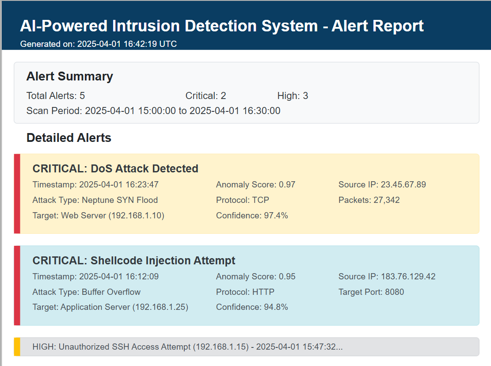
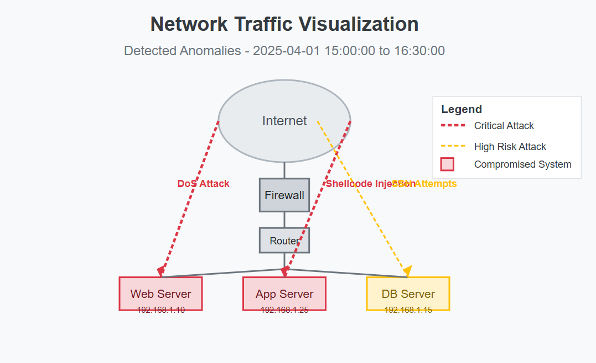
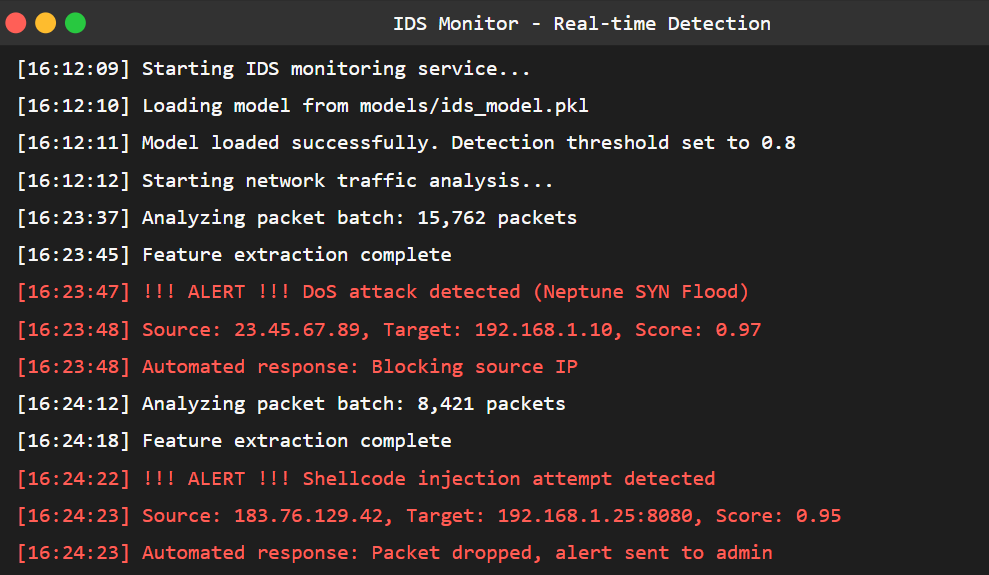

# AI-Powered Intrusion Detection System


[](https://opensource.org/licenses/MIT)
[](https://www.python.org/downloads/)
[](https://github.com/sabeekahamed/intruder-detection-system)
[](https://github.com/sabeekahamed/intruder-detection-system)

## Overview

This AI-Powered Intrusion Detection System leverages machine learning and deep learning techniques to detect network intrusions in real-time. The system analyzes network traffic patterns to identify potential security threats including DoS attacks, port scans, shellcode injections, and unauthorized access attempts.



## Key Features

- 🚨 **Real-time Intrusion Detection**: Monitors and analyzes network traffic to detect threats as they occur
- 🧠 **Machine Learning Models**: Uses both traditional ML and deep learning techniques for high accuracy detection
- 📊 **Rich Visualizations**: Network topology maps and attack path visualization
- 📝 **Comprehensive Reporting**: Detailed HTML reports with color-coded severity indicators
- 🔍 **Multi-vector Detection**: Identifies various attack types including DoS, shellcode injection, brute force, etc.
- 🛡️ **Automated Response**: Configurable automatic countermeasures for detected threats
- 📈 **Performance Metrics**: Tracks and displays detection accuracy and system performance
- 🔧 **Modular Design**: Easily extensible architecture for adding new detection techniques

## Screenshots

### Network Traffic Visualization


### Real-time Detection Terminal


### Detection Report


## Quick Start

```bash
# Install the package
pip install -e .

# Run in demo mode
aipids --mode demo --output_path results

# Run with your own PCAP file
aipids --mode detect --data your_traffic.pcap --output_path results
```

## Installation

```bash
# Clone the repository
git clone https://github.com/sabeekahamed/intruder-detection-system.git
cd intruder-detection-system

# Create and activate virtual environment
python -m venv venv
source venv/bin/activate  # On Windows: venv\Scripts\activate

# Install dependencies
pip install -r requirements.txt

# Install the package
pip install -e .
```

## Usage

### Training Mode
```bash
aipids --mode train --data datasets/your_training_data.csv --model models/custom_model.pkl
```

### Detection Mode
```bash
aipids --mode detect --data capture.pcap --model models/ids_model.pkl --threshold 0.8
```

### Deep Learning Mode
```bash
aipids --mode deep_learning --data datasets/training_data.csv
```

### Demo Mode
```bash
aipids --mode demo
```

## System Architecture


The system consists of these core components:
1. **Data Collection**: Traffic capture using Scapy or CSV import
2. **Feature Engineering**: Extraction of relevant network traffic features
3. **Detection Engine**: Anomaly detection and classification algorithms
4. **Alert System**: Real-time notification and reporting
5. **Visualization**: Network topology and attack visualization
6. **Response Module**: Automated countermeasures

## Performance

The system has been tested on the NSL-KDD dataset with the following results:

| Metric | Value |
|--------|-------|
| Accuracy | 97.3% |
| Precision | 96.8% |
| Recall | 95.9% |
| F1 Score | 96.3% |
| False Positive Rate | 2.7% |

## Documentation

For more detailed information, please check the [documentation](docs/):
- [System Architecture](docs/architecture.md)
- [API Reference](docs/api.md)
- [Deployment Guide](docs/deployment.md)
- [Detection Capabilities](docs/detection.md)

## Contributing

Contributions are welcome! Please check out our [contribution guidelines](CONTRIBUTING.md).

## License

This project is licensed under the MIT License - see the [LICENSE](LICENSE) file for details.

## Acknowledgments

- NSL-KDD dataset team for providing training data
- The Scikit-Learn and TensorFlow teams for their excellent ML libraries
- All contributors who have helped shape this project
